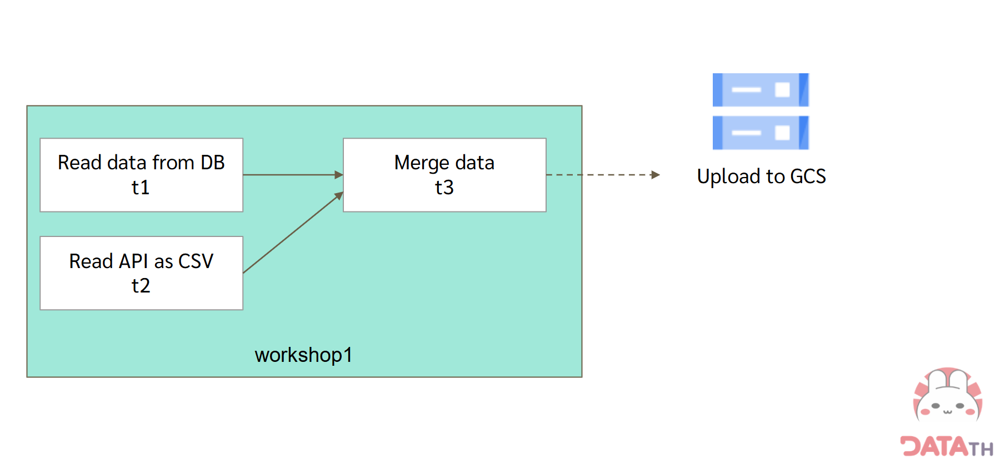
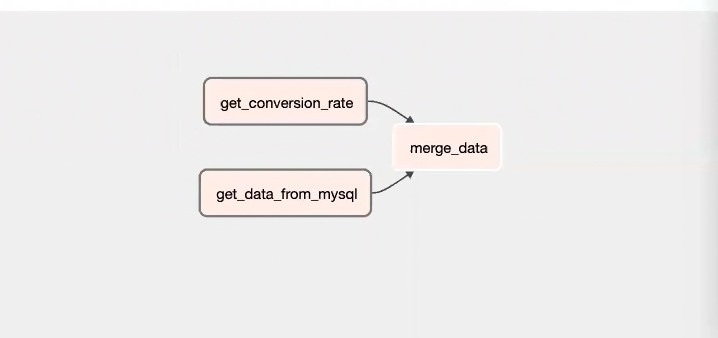
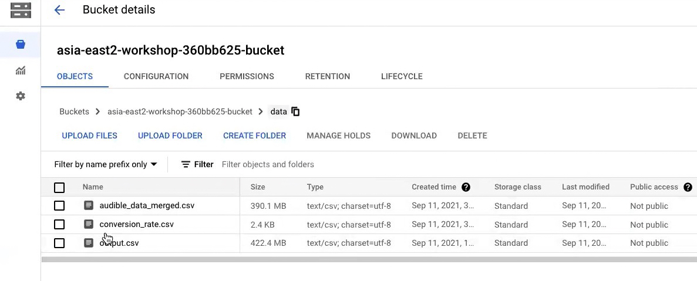
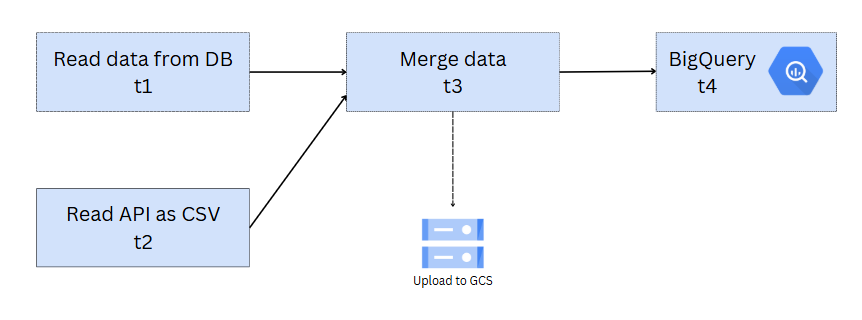
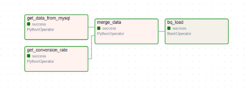
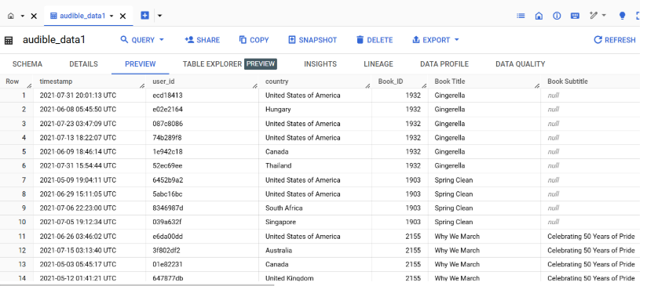
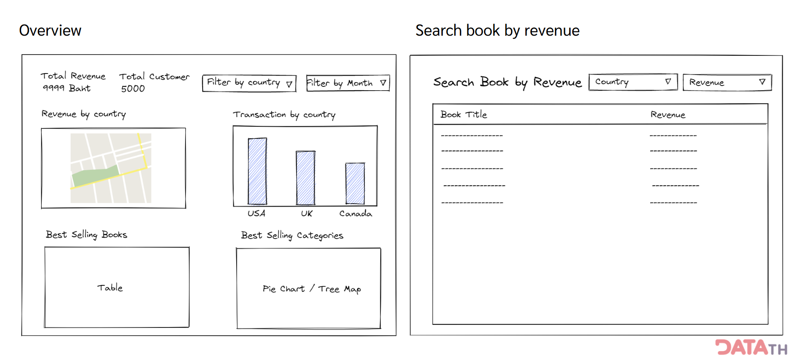
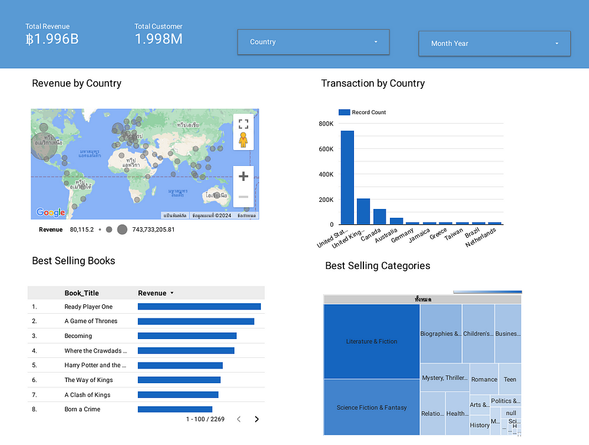
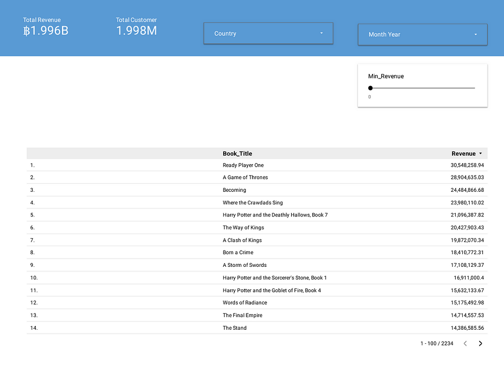
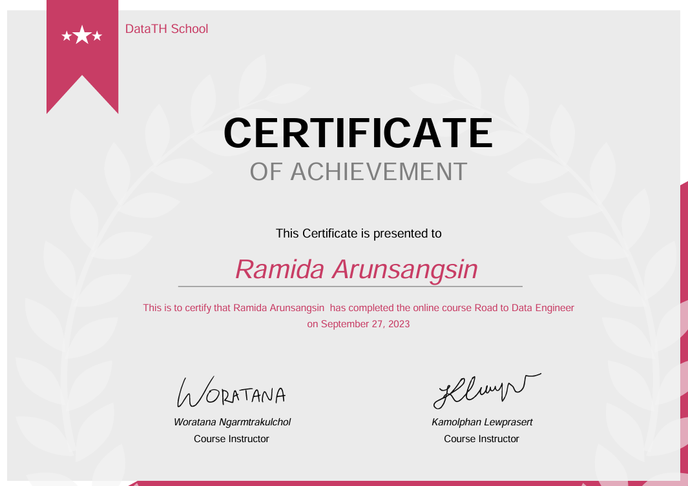

## Chapter 1 Data Pipeline & ETL
    ➤ Data Pipeline
    ➤ Data Pipeline Design
    ➤ Data integration

【Workshop 1 Data Collection with Python】
    

    : Collect data from "database" and "REST API" with Python
    
    To-do list:
        Read data from MYSQL database
        Join data table
        Get data from REST API

## Chapter 2 Data Cleansing
    ➤ Data Cleansing & Data Quality
    ➤ Exploratory Data Analysis (EDA)
    ➤ Data Anomaly
    ➤ Distributed Data Processing
    ➤ Apache Spark

【Workshop 2 Data Cleansing with Spark】

    To-do list:
        Data Profiling
        Exploratory Data Analysis (EDA)
        Data Cleansing with Spark

## Chapter 3 Cloud Computing
    ➤ Intro to Cloud Computing
    ➤ Cloud Computing Concepts
    ➤ Google Cloud Platform
    ➤ Intro to Bash

## Chapter 4 Data Pipeline Orchestration
    ➤ Apache Airflow & Google Cloud Composer

【Workshop 4 Automated Data Pipeline with Airflow】

    To-do list:
        Google Cloud Composer manage Apache Airflow
        Automated Data Pipeline with Airflow

       Final, file was stored in GCS

## Chapter 5 Data Warehouse
    ➤ Concept of Data Warehouse
    ➤ Google BigQuery

【Workshop 5 Data Warehouse with BigQuery】

    To-do list:
        Continue from workshop4
        Create new task for upload data to BigQuery

Preview of data in bigquery

## Chapter 6 Report & Dashboard
    ➤ Basic Data Visualization for Data Engineers
    ➤ Looker Studio

【Workshop 6 Data Visualization with Looker Studio】

    : Do a dashboard by using Looker Studio

    To-do list:
        Create view
        Connect Looker Studio data source to created view
        Create dashboard
    

    Dashboard result..

## Certificate
