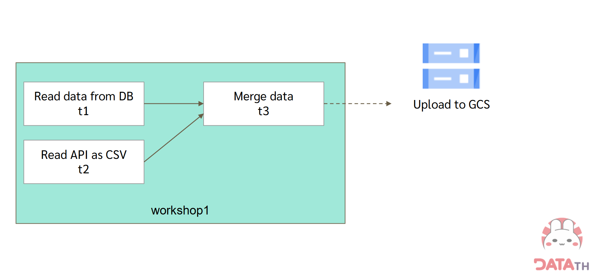
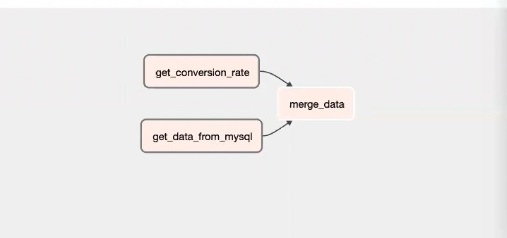
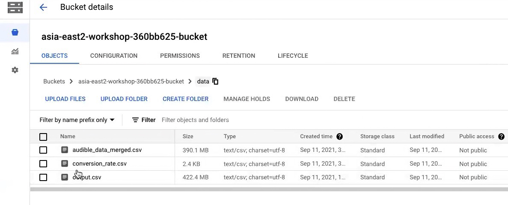

## Chapter 4 Data Pipeline Orchestration
    ➤ Apache Airflow & Google Cloud Composer

【Workshop 4 Automated Data Pipeline with Airflow】

    To-do list:
        Google Cloud Composer manage Apache Airflow
        Automated Data Pipeline with Airflow

       Final, file was stored in GCS
