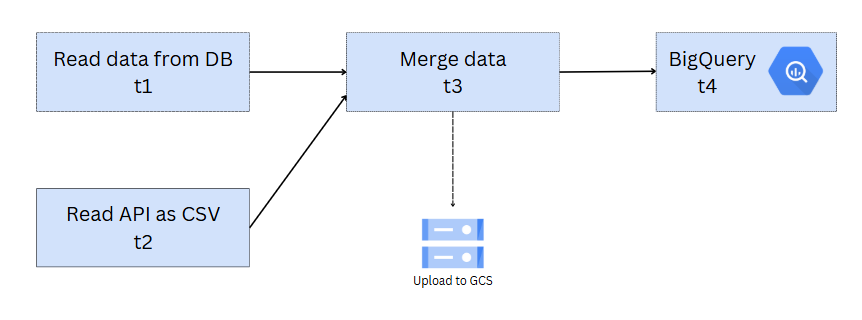
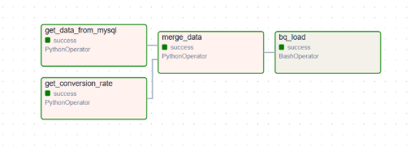
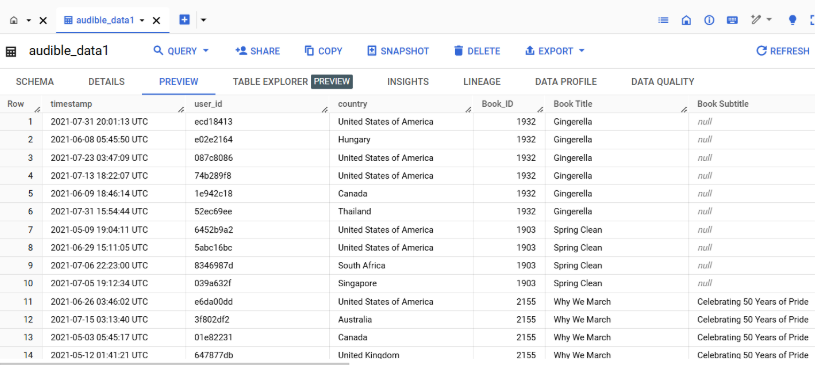

## Chapter 5 Data Warehouse
    ➤ Concept of Data Warehouse
    ➤ Google BigQuery

【Workshop 5 Data Warehouse with BigQuery】

    To-do list:
        Continue from workshop4
        Create new task for upload data to BigQuery

Preview of data in bigquery
